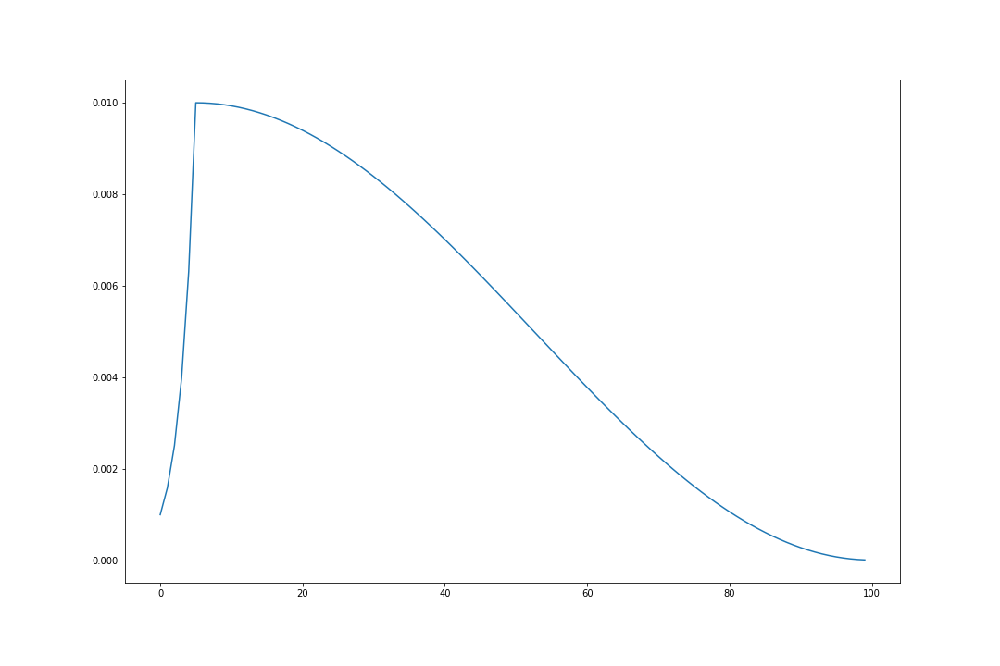

# LR-Warmup-with-Cosine-Annealing

## How to use
```python
import torch.optim as optim
from torchvision.models import resnet18

# Hyper-parameters
lr_warmup_epoch = 5
total_epochs = 100

inital_lr = 1e-3
eta_min = 1e-5

# Network
model = resnet18()

# Compile
optimizer = optim.Adam(model.parameters(), lr=inital_lr)
scheduler = CosineAnnealingLR(optimizer, eta_min=eta_min, T_max=(total_epochs - lr_warmup_epoch))

# Main
for epoch in range(total_epochs):
    '''
    train code
    '''
    
    optimizer.step()
    lr_update(epoch, lr_warmup_epoch, optimizer, scheduler)
```


## Learning Rate Graph
- lr_warmup_epoch=5, total_epochs=100, initial_lr=1e-3, etamin=1e-5


